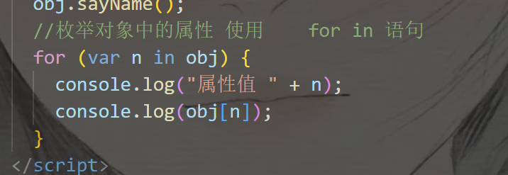

# 8.3

## Cs /Bs 模式

Client/ server 客户端/服务器

常用于大型游戏  cf qq飞车

\1.  均需下载客户端

\2.  软件由客户端和服务器两部分组成

\3.  更新需同步到每终端，比较麻烦

\4.  运算压力均分到各终端，服务器压力减小

 

Browser/ server 浏览器/服务器

常用于网页 淘宝 12306

\1.  不需要下载客户端

\2.  软件全部 部署服务器端

\3.  更新简单，更新只需在服务器

\4.  运算压力基本在服务端，不用来做大型游戏开发

 

## 互联网三大基石： url 、 http协议、 html

   url: 统一资源定位符

   http协议：共同遵守的语言协议、 数据解析规范

   html: 超文本标记语言

小明给小红传纸条： 

   url: 小红位置-地址

   http协议： 双方共同能遵守的语言 —中文

   html: 纸条上的内容 信息的载体 — 今晚约会 !

 

## Html: 超文本语言 描述网页的语言，内嵌在浏览器中

  Hyper text markup language

\1.  超文本： 可展示、文本、声音、图片等多媒体内容

\2.                                 

标签： 尖括号包围的关键词 <html>

**封闭类标记**（**双标记**） 成对出现 <p> </p> 

前为 开始/ 开放 标签

后为  结束/ 闭合 标签

非封闭类标记： 叫做空标记 单标记 ， <br/>

 

 

 

<html>

<head>


</head>

<body>

</body>

</html>

 

Html 根标签是最外层的标签

含有两个一级**子标签**和 head、body

Head 为不显示在页面上，但比较重要的内容

Body 为显示在页面上的内容

 

# 9.6

 

 

<meta> 标签提供了HTML 文档的元数据  存在于head标签内


## 9.12  学习进度

1. 主要学习了格式化标签，初步认识了 css样式，段落标签中的 style 中 font字体的size、color、family、width

​		aqua 蒂芙尼蓝色

2. 字符实体： 一些类同标签符号的语句，由于html会自动识别语句，所以需要用到实体转化语句 如<br> 得用成 &lt ; br &gt ;

3. 超链接标签： <a> <a/> a 标签， 锚点设置 href="路径位置"  如图  #为跳转自己，target_self 从当前页跳转，_blank 从新的一页跳转
4. 

5.多媒体标签， audio img video 

​							img 中的 alt是为当前图片加载不出来显示的内容

​							audio 和 video 中需要 controls 中的插件才能显示出来音频文件，auto play 自动播放，loop为循环次数


# 9.21 学习进度

1.学习了列表标签 有序和无序  ol ul，中type不同，所显示的序号不同， <lib> 标签，标签中有序和无序的嵌套


2.详情标签 dl图片、dd文字

3.table标签   thead、 tbody、 tfoot 标签分化对不同部分好处理 样式 th居中加粗  

​		table中嵌套table/  rowspan 跨行并、 colspan 跨列并、

​			 border所有框线、 cellpading单元格大小   cellspacing 框线间距

tip： 跨行并，跨列并后，需在合并后的下一个单元格填写信息


# js学习

1. ##### 数据类型


双引号内容的隔开需要使用； 无引号需要用 ，


##### 计时器  

​		console.time("命名")  内需加双引号

​			执行语句

​		console.timeEnd("命名")


##### 栈和堆

​	一般变量的是在栈内生成，对象的变量也是（指向堆中的空间）

​	栈内变量 == 栈内变量 （比较的是数值）

​	对象变量 ！== ，即使内容相同，所指向的地址不同，属于不同的两个堆空间

 


##### 传入函数的实参数量和 形参之间的关系

大于不会报错（结果可能有误），小于会出现 形参未被赋值，未定义


函数就是对象，对象与函数均可以作为实参传递到形参，并且函数内可嵌套函数


##### 立即执行函数 

​	需要以（） 类似c中的无参函数

​		( function(){

```js
	   alert("我是立即执行函数")

	  })
```

执行方式； （）;


##### **枚举：**




**var** 属性 或 声明函数，都会在程序运行之前生成，相当于置顶位置处理，但是赋值的语句需要在执行本条语句过后，才能生效

##### 全局作用域 和 局部作用域

​    **全局作用域**： window(可视窗口)  局部作用域：**函数** 会屏蔽全局作用域（当具有相同的声明变量或函数时）

​		函数内变量 可访问全局变量，反则不可，当 函数内部没有所要进行的操作变量或函数时，会逐步向外找

，	在函数内**未声明的变量**，会被系统认定为 **全局变量**（ 有定义形参的情况除外）


##### **谷歌浏览器调试**：

​		 源代码中指定行数 使运行暂停到某一步骤，监视 可加入所要监视的对象


##### this:

​	this 谁调用this，就指向谁，多用于对 对象数据的处理 


##### 构造函数生成一类，类生成对象：


##### 原型：

​	对象和类的共享空间，对象均可以使用的静态空间

​                  


##### 检测对象是否含有某个属性

​	 如 congosle.log( person1.hasOwnProperty("属性名") )，在当前对象中，是否含有此属性

**原型的进入方法**： person. \_\_proto\_\_ (此为进入原型，左右下划线各为) 	 


##### 数组

​		数组也是对象，具备对象的功能

​			var arr =new Array[1,2,3]  此语句为构造 数组元素为3 的数组

​			var arr =new Array（2） 括号表示个数  此语句为构造 数组元素为2 的数组

​		数组内的元素多样化， 可以是变量、函数、对象、数组...  


###### 数组方法

1. arr.push() 尾部添加，并返回数组长度
2. arr,shift() 删除数组第一个元素，并将删除元素返回
3. .pop() 弹出最后一个元素，并将其返回
4. .unshift() 向数组开头添加一个或多个元素，并返回新的数组长度，原本数组元素往后移，下标添加x位
   1. 以下为数组方法的补充
5. .slice(),提取元素并将其返回，不修改原数组，（x,y） 为左闭右开，y可为负数，表示倒数X个，前者不能小于后者
6. splice()，用于删除数组的指定元素，修改原数组，并将被删除的元素返回（x,y,"z","z1"） x表示开始位置的索引，y表示删除的元素个数，z和z1自动插入到开始位置索引的前面，替代原本元素的位置
7. concat()，连接数组并返回数组，对原数组无影响，可在连接数组后，新添字符串或对象，也作为连接合并作业
8. reverse() 对原数组进行倒转
9. join() 将数组转化为字符串，对原数组无影响，并将字符串返回，join（"符号"），符号表示连接的字符
10. sort() 对数组元素排序，修改原数组 ，可在数组内添加回调函数，指定排序规则，见代码

```js
    // slice (), 从数组提取元素并将元素返回， 不会修改数组的元素
      //  slice(x,y)  从数组下标(索引)为x的元素提取，结束于y, 前[x,y), 含x不含y
      //     y是负数时，表示倒数， -1 倒数第一个，-2表示倒数第二个
      var arr1 = ["林修", "金乌", "九头犬", "萧红眉"];
      result = arr1.slice(0, -1);
      //   console.log("提取出来的元素为 倒3（萧九金）：" + result)  倒向提取不了
      console.log(result);

      /* splice (类似python的切片) 用于删除数组的指定元素 （能修改原数组的元素）
                 - 将被删除的元素作为返回值 返回
              - 参数 splice(x, y，“z”,"z1")   
              -  x 表示： 开始位置的索引，y表示删除的数量
            y 后的 z1 z2为所传递的元素， 元素将会自动插入到 开始位置索引的前面
             */

      arr1.splice(2, 1, "阳天", "王浩");
      console.log(arr1);


  // concat(), 连接数组 作用  对原数组无影响
      arr = ["林修", "王浩", "白小纯", "萧红媚"];
      arr1 = ["林动", "萧衍", "萧鼎"];
      var result = arr1.concat(arr, "无极霆");
      console.log("连接后的两个数组" + result);

      //reverse(),对原数组进行倒转
      arr2 = [1, 2, 3, 4, 5, 6];
      arr2.reverse();
      console.log("倒转后arr2数组元素是：（6,5，4，3，2，1）" + arr2);

      // join()  将数组转化为字符串， 对原数组无影响
      //    将转换后的字符串作为结果返回， join（“指定的字符串”） 作为元素的连接符
      result = arr.join("@_@");
      console.log(
        "使用join（）方法将数组转化为字符串，并用指定字符连接：" + result
      );

      /*sort()  对数组内元素排序，会影响原数组，默认按照Unicode进行排序
        可在内部添加一个回调函数，指定排序规则
         回调函数 需要定义两个形参, 浏览器会使用数组中的实参去调用回调函数
            数组a 一定在 b 前
        如果返回值 >0, 交换位置， <= 0, 元素位置不变
      */

      arr2.sort(function (a, b) {
        return a - b;
      });
      console.log(arr2);
```


###### 数组遍历

forEach(),见代码块及注释

需要一个函数作为参数传递	

​	函数内部可定义三个参数（1.value，2.index.3,obj)

括号内数字代表对应位置 参数所被赋值的类型

​	关于遍历时，数组为字符串时

console.log("字符串"+value)等能正确显示

​	数组为对象时，返回为元素类型：object object

如要正确显示，只能有形参值，如上："字符串"去除

```js
<!DOCTYPE html>
<html lang="en">
  <head>
    <meta charset="UTF-8" />
    <meta http-equiv="X-UA-Compatible" content="IE=edge" />
    <meta name="viewport" content="width=device-width, initial-scale=1.0" />
    <title>Document</title>
    <script>
      function Person(name, age) {
        this.name = name;
        this.age = age;
      }
      var p1 = new Person("林修", 1008);
      var p2 = new Person("小金乌", 7);
      var p3 = new Person("玉帝之子", 15);
      var p4 = new Person("肖韵", 27);
      var p5 = new Person("晓梅", 18);
      var arr = [p1, p2, p3, p4, p5];

      //   将满18的元素 筛选放到一个新的数组并输出
      function getAdult(arr) {
        var newarr = [];
        for (var i = 0; i < arr.length; i++) {
          if (arr[i].age >= 18) {
            newarr.push(arr[i]);
          } else continue;
        }
        return newarr;
      }
      var newarr = getAdult(arr);
      console.log("新数组中满18岁的元素是 ", newarr);
      console.log("满足的元素个数为：(3) " + newarr.length);

      /*   数组遍历 forEach(), 需要一个函数作为参数  (仅支持内核 IE8以上的浏览器，ie不能运行此方法)
             遍历的次数 = 元素个数， 这种函数是由系统进行调用， 称为 回调函数
                第一个参数： 当前正在遍历的元素 
                第二个参数： 当前正在遍历的元素的索引 
                第三个元素：正在遍历的数组
     */
      //  数组的遍历，当数组的元素为 单一变量时，返回时 为属性值
      var arr1 = ["林修", "金乌", "九头犬", "萧红眉"];
      arr1.forEach(function (value, index, obj) {
        console.log("每个元素的内容： " + value);
        console.log("元素下标： " + index);
        console.log("整个对象（数组）：" + obj);
      });

      console.log("---------这是分割线--------");
      //  数组的遍历，当数组的元素为 对象时，
      // 语句为 xx+属性名时   返回时 为元素类型 ：（object object）
      //  去除双引号文本内容后，才是元素信息
      newarr.forEach(function (value, index, obj) {
        console.log(value);
        console.log("元素下标： " + index);
        console.log("整个对象（数组）：" + obj);
      });
    </script>
  </head>
  <body></body>
</html>

```


###### 函数方法

​	1.函数名.call() 函数名.apply()，作用类同，括号内为指定对象去运行某个函数

​	不同的是，apply所要传递的实参需要以数组封装

如：fun1.call(p1, 20, "王浩");

​	fun1.apply(p1, [18, "林修"]);

```js
<!DOCTYPE html>
<html lang="en">
  <head>
    <meta charset="UTF-8" />
    <meta http-equiv="X-UA-Compatible" content="IE=edge" />
    <meta name="viewport" content="width=device-width, initial-scale=1.0" />
    <title>Document</title>
    <script>
      /* call() 和 apply（）为函数对象的方法，需要通过函数对象调用 
         这两个方法的作用为： 调用函数执行
         括号内 可以将一个对象指定为一个参数传入
    此对象会成为该函数执行的this， 不执行此方法，调用函数为 window
       
    函数定义多个形参时    
        call() 方法可以将实参在对象之后依次传递实参
        apply()方法需要将实参封装在 数组中
        
    - this的情况
        1. 函数调用时，this 永远时window
        2. 以方法调用时，this为调用方法的对象
        3. 以构造函数形式调用时， this是新创建的对象
        4. 使用call、 apply调用， this为用户 所指定 传入的对象
        */
      var name = "window";
      var obj = { name: "林修" };
      function fun() {
        console.log(this);
        console.log("调用该函数的为：" + this.name);
      }
      fun();
      fun.call(obj);

      var obj = new Object();
      function fun() {
        console.log(this.name);
      }

      //   指定对象 更改指定对象的值
      function fun1(age, name) {
        this.age = age;
        this.name = name;
        console.log("调用该函数的为：" + this.name);
      }
      fun1(17, "我是改后的window名咯"); //window 传入的参数,如不传入,函数中的name未被赋值,传回为undefine
      var p1 = { age: 18, name: "林修" };
      fun1.call(p1, 20, "王浩");
      //   p1.toString(name + age + "岁");
      console.log(p1);
      fun1.apply(p1, [18, "林修"]);
      console.log(p1);
      console.log(this.name);
    </script>
  </head>
  <body></body>
</html>

```


###### 函数所被浏览器传递的两个隐含参数

​	1.argunments(): 类数组对象（非数组），即使函数未定义形参，其他对象在调用函数时，会自动保存在argunments()中

​	2. callee: 指向函数本身

```js
<!DOCTYPE html>
<html lang="en">
  <head>
    <meta charset="UTF-8" />
    <meta http-equiv="X-UA-Compatible" content="IE=edge" />
    <meta name="viewport" content="width=device-width, initial-scale=1.0" />
    <title>Document</title>
    <script>
      /* 在调用函数时，浏览器每次都会传递进两个隐函的参数
        1. 函数的上下文对象 this
        2. 封装实参的对象 argunments
            -argunments 是一个类 数组对象（但不是数组），可通过索引来操作数据 也可以获取长度
            -调用函数时，所传递的实参都会在argunments保存
            - 我们即使不定义形参，可以通过 argunments 使用实参
            
            callee
             此函数对应一个函数对象，指向函数本身
    */
      function fun() {
        console.log(arguments instanceof Array); //检测一个对象是否是一个类（构造函数）的实例
        console.log(Array.isArray(arguments)); //检测arguments 是否是数组
        console.log(arguments.length);
        console.log(arguments[0]);
        console.log(arguments.callee);
      }

      fun("林修", 18);
    </script>
  </head>
  <body></body
</html>

```

<!DOCTYPE html>
<html lang="en">
  <head>
    <meta charset="UTF-8" />
    <meta http-equiv="X-UA-Compatible" content="IE=edge" />
    <meta name="viewport" content="width=device-width, initial-scale=1.0" />
    <title>Document</title>
    <script>
      /* 在调用函数时，浏览器每次都会传递进两个隐函的参数
        1. 函数的上下文对象 this
        2. 封装实参的对象 argunments
            -argunments 是一个类 数组对象（但不是数组），可通过索引来操作数据 也可以获取长度
            -调用函数时，所传递的实参都会在argunments保存
            - 我们即使不定义形参，可以通过 argunments 使用实参


            callee
             此函数对应一个函数对象，指向函数本身
    */
      function fun() {
        console.log(arguments instanceof Array); //检测一个对象是否是一个类（构造函数）的实例
        console.log(Array.isArray(arguments)); //检测arguments 是否是数组
        console.log(arguments.length);
        console.log(arguments[0]);
        console.log(arguments.callee);
      }
    
      fun("林修", 18);
    </script>

  </head>
  <body></body>
</html><!DOCTYPE html>
<html lang="en">

  <head>
    <meta charset="UTF-8" />
    <meta http-equiv="X-UA-Compatible" content="IE=edge" />
    <meta name="viewport" content="width=device-width, initial-scale=1.0" />
    <title>Document</title>
    <script>
      /* 在调用函数时，浏览器每次都会传递进两个隐函的参数
        1. 函数的上下文对象 this
        2. 封装实参的对象 argunments
            -argunments 是一个类 数组对象（但不是数组），可通过索引来操作数据 也可以获取长度
            -调用函数时，所传递的实参都会在argunments保存
            - 我们即使不定义形参，可以通过 argunments 使用实参


```js
        callee
         此函数对应一个函数对象，指向函数本身
*/
  function fun() {
    console.log(arguments instanceof Array); //检测一个对象是否是一个类（构造函数）的实例
    console.log(Array.isArray(arguments)); //检测arguments 是否是数组
    console.log(arguments.length);
    console.log(arguments[0]);
    console.log(arguments.callee);
  }

  fun("林修", 18);
</script>
```

  </head>
  <body></body>
</html><!DOCTYPE html>
<html lang="en">

  <head>
    <meta charset="UTF-8" />
    <meta http-equiv="X-UA-Compatible" content="IE=edge" />
    <meta name="viewport" content="width=device-width, initial-scale=1.0" />
    <title>Document</title>
    <script>
      /* 在调用函数时，浏览器每次都会传递进两个隐函的参数
        1. 函数的上下文对象 this
        2. 封装实参的对象 argunments
            -argunments 是一个类 数组对象（但不是数组），可通过索引来操作数据 也可以获取长度
            -调用函数时，所传递的实参都会在argunments保存
            - 我们即使不定义形参，可以通过 argunments 使用实参


```js
        callee
         此函数对应一个函数对象，指向函数本身
*/
  function fun() {
    console.log(arguments instanceof Array); //检测一个对象是否是一个类（构造函数）的实例
    console.log(Array.isArray(arguments)); //检测arguments 是否是数组
    console.log(arguments.length);
    console.log(arguments[0]);
    console.log(arguments.callee);
  }

  fun("林修", 18);
</script>
```

 

###### Date()类,所生成的对象具有的方法

- 新建一个Date对象时， 如无传递字符串时，时间对象字符串内容为 当前代码运行的时间

1. .getFullyear(): 所在年份
2. .getMonth(): 所在月份
3. getDate(): 所在日数
4. getDay(): 所在星期的第几天
5. getTime(): 时间戳 ，距离格林威时间1970 01 01 00：00：00到当前所花费的毫秒数

- 将time转化为: 当前时间： 1970 +time/1000/60/60/24/365

```js
<!DOCTYPE html>
<html lang="en">
  <head>
    <meta charset="UTF-8" />
    <meta http-equiv="X-UA-Compatible" content="IE=edge" />
    <meta name="viewport" content="width=device-width, initial-scale=1.0" />
    <title>Documen获得d1的所在日数t</title>
    <script>
      var d = new Date(); //无传递字符串时，为当前代码运行的时间
      console.log(d);
      //  "月/ 日/ 年/ 时"
      var d1 = new Date("12/13/2022 12:13:20");
      console.log(d1);

      //   获得d1的时间 由用户自己定义
      // 获得 d1的年 月份 日数 周几
      var d3 = d1.getFullYear();
      var d4 = d1.getMonth();
      var d5 = d1.getDate();
      var d6 = d1.getDay();
      console.log("获得d1的所在年份" + d3);
      console.log("获得d1的所在月份" + d4);
      console.log("获得d1的所在日数" + d5);
      console.log("获得d1的所在星期的周" + d6);

      /*   getTime()
            -获取当前日期的时间戳
            -时间戳 指的是从格林威标准时间1970年 1月1日 0时0分0秒
                到当前日期所花费的毫秒数 1秒 = 1000毫秒
            - 计算机底层保存时间使用都为 时间戳
      */
      var time = d1.getTime();
      console.log(time);
      console.log(1970 + time / 1000 / 60 / 60 / 24 / 365);
      //   可用时间戳 计算程序的运行的时间， 在语句前定义一个时间戳，语句后定义一句，相减
    </script>
  </head>
  <body></body>
</html>

```


##### Math属性和方法

- Math 为一个数学工具包

1. 向上取整： Math.ceil()
2. 向下取整： Math.floor()
3. 四舍五入： Math.round()
4. 最大和最小值： .max() 和 .min()
5. .pow(x,y) 返回x的 y次方
6. .sprt: 开方

```js
<!DOCTYPE html>
<html lang="en">
  <head>
    <meta charset="UTF-8" />
    <meta http-equiv="X-UA-Compatible" content="IE=edge" />
    <meta name="viewport" content="width=device-width, initial-scale=1.0" />
    <title>Document</title>
    <script>
      // abs() 计算一个 数的绝对值
      console.log(Math.abs(-7));
      //  向上取整 ceil()  向下取整floor()  四舍五入 round()
      console.log("向上取整" + Math.ceil(1.1));
      console.log("向下取整" + Math.floor(1.1));
      console.log("四舍五入(1.1) " + Math.round(1.1));
      console.log("四舍五入(1.5) " + Math.round(1.5));

      //   random() -生成一个0-1 间的随机数  [0, 1)
      for (var i = 0; i < 10; i++) {
        console.log("0-1间的随机数" + Math.random());
      }

      //   Math.round(Math.random()* (y-x) +x ) 表示 随机生成 x - y 的数
      for (var i = 0; i < 10; i++) {
        console.log("1-10间的随机数" + Math.round(Math.random() * 9 + 1));
      }

      // max() 和 min() 求数值最大和数值最小
      console.log(Math.max(11, 99, 88));
      console.log(Math.min(11, 99, 88));

      // Math.pow(x, y) 返回x 的 y次幂
      console.log(Math.pow(2, 3));

      //   Math.sqrt()  开方计算
      console.log(Math.sqrt(49));
    </script>
  </head>
  <body></body>
</html>

```


##### 包装类：基本数据类型转化 转化对象	

-    转化之后具备对象的功能，可为其定义属性和方法

var a  = new Number(7)// 定义一个数字对象 7 

1. String() 转化为 String对象
2. Number() 转化为 Number对象
3. Boolean() 转化为 Boolean对象


```js
<!DOCTYPE html>
<html lang="en">
  <head>
    <meta charset="UTF-8" />
    <meta http-equiv="X-UA-Compatible" content="IE=edge" />
    <meta name="viewport" content="width=device-width, initial-scale=1.0" />
    <title>Document</title>
    <script>
      /* 基本数据类型 String Number Boolean Undefined 
            引用数据类型 Object
            js中提供三个包装类,通过三种包装类将基本数据类型转化为对象
                - String()  转化为 String 对象
                - Number()  转化为 Number 对象
                - Boolean() 转化为 Boolean 对象
        */
      // 转化为对象后 具备对象的功能 属性 方法都可定义
      var a = new Number(7);
      a.name = "林修";
      console.log(a);
      console.log(a.name);

      // 不将其转化为对象时,虽浏览器临时会将其转化,检查类型时也为对象,但定义未成功
      var b = 7;
      b = b.toString();
      b.name = "王浩";
      console.log(typeof b);
      console.log(b);
      console.log(b.name); //未将其转化为对象 所以显示的为 未定义

      // 定义为对象时 比较的为地址,内容相同, 地址不同, 全等 返回为false
      var c = true;
      var d = new Boolean(true);
      console.log(c === d); //

      //   e内容即使为false,因为返回的为对象所以也能运行
      var e = new Boolean(false);
      if (e) {
        console.log("由于d是对象,所以为真,即使内容值为false该语句能运行");
      }
    </script>
  </head>
  <body></body>
</html>

```


##### 字符串的方法

1.  str.length : 返回字符串的长度，包含空格

2. .charAt（索引）： 根据索引返回字母

3. .chatCodeAt（索引）： 根据索引返回其Ascii

4. fromCharAt(索引)： 返回字符

5. .concat(): 连接多个字符 与+作用

6. .indexof(x,y): x为检索字符串中是否含有此字符串，y为第x次出现的索引，不添加y时，默认返回第一次出现的索引

7. .lastIndexof(x,y): y为倒数第y处开始查找

8. .slice(x,y)  [ ) x表示开始位置的索引，y表示结束位置的索引，y可为负数，表示 倒数+y个   不加参数y时，表示从x索引截取到尾部

9.  .substring(x,y) 类同slice() 但是y不能接受负数,当传递参数为负数时，系统会自动将其转化为0， 会自动调整，x为比y小值

10. .sunstr(x,y) x： 为开始位置的索引 y: 截取长度

11. .toUpperCase() 和 .toLowerCase() 将字符串转化大小写

12. spilt() 将字符拆分为数组，括号内为定义的参数作为拆分数组的规则，以此参数划分字符数组并消失，分割后的数组以 , 间隔分开

    

```js
<!DOCTYPE html>
<html lang="en">
  <head>
    <meta charset="UTF-8" />
    <meta http-equiv="X-UA-Compatible" content="IE=edge" />
    <meta name="viewport" content="width=device-width, initial-scale=1.0" />
    <title>Document</title>
    <script>
      // 字符串具备的方法 ,lenghth属性 可获取字符的长度, 空格也算一个字符
      str = "Hello world";
      console.log("str的字符长度为: " + str.length);
      //     charAt()
      //        - 返回指定位置的字符, 根据括号内索引返回
      var result = str.charAt(0);
      console.log("返回的字符为:(H) " + result);

      //   charCOdeAt()
      //         - 返回指定索引字符 的Code 码
      result = str.charCodeAt(0);
      console.log("返回H的ASCII码: " + result);

      //   fromCharCode(),
      //          - 根据字符编码获取字符
      result = String.fromCharCode(72);
      console.log("72编码获取到的字符为:" + result);

      //   concat()  - 连接两个或多个字符 ,于+ 作用类同
      result = str.concat("林修", "王浩");
      console.log("连接后的字符为" + result);

      /* indexOf() 
            - 检索一个字符串中是否含有指定内容
            - 如果含有该内容,返回第一次出现的索引, 如果未出现 返回 -1
            - 可以指定一个 第二参数, 指定 第几次出现的位置
    */
      str1 = "hello world";
      result = str1.indexOf("h");
      console.log("h第一次出现的索引" + result);
      // 指定第二参数
      result = str1.indexOf("o", 4);
      console.log("从索引4开始找o: (4) " + result);
      //   使用方法于 indexOf() 一样,从后往前找
      result = str1.lastIndexOf("h");
      console.log("h从后往前找第一次出现的索引 (0): " + result);
      //      从后往前找字符,参数不能是负数, 包含所指定的索引
      result = str1.lastIndexOf("o", 4);
      console.log("倒数第4个字符开始找o " + result);

      //---------------------截取字符--------------------------------
      //   slice() 可以从字符串中 截取所指定位置的字符,并将字符返回
      //   单个参数传入时,表示从此位置的索引往后截取
      //   - (x, y)  x表示开始位置的索引, y表示结束位置的索引 [ )
      //       - y可为负数, 表示 倒数第x个
      result = str1.slice(0, 5);
      console.log("返回的字符为(hello): " + result);
      //   单个参数传入时,表示从此位置的索引往后截取
      result = str1.slice(6);
      console.log("返回的字符为 (helloWorld): " + result);

      /*   substring() 可用来截取字符, slice() 类同
        -参数
            - (] 包含开始位置的索引,不包过结束位置的索引,但是 y 不能接受负值作为参数
            -   当传递了赋值,则默认使用0
            -   自动调整参数的位置, 会将大的索引置于后一位
    */
      result = str1.substring(6, -1);
      console.log("返回的字符为(hello) :" + result);

      //   substr() -截取字符 （x,y） x:截取开始位置的索引  y: 截取的长度
      result = str1.substr(0, 5);
      console.log("(hello)" + result);

      //-toUpperCase() 将字符转化为大写并返回
      // - toLowerCase() 将字符转化为小写并返回
      result = str1.toUpperCase();
      console.log("字符都转化为大写： " + result);
      result = str.toLowerCase();
      console.log("字符都转化为小写 " + result);

      // split()
      //        - 可以将一个字符拆为数组
      //          -需要一个字符串作为参数,会根据该参数拆分数组
      str = "ab,cde,fg,hij";
      result = str.split(",");
      console.log("返回的数组为以(ab,cde,fg,hij ):");
      result = str.split("");
      console.log("当分割的字符串标识为空时,会拆分每一个字符" + result);
    </script>
  </head>
  <body></body>
</html>

```


##### 正则表达式

正则表达式 = 规则表达式

- var reg = RegExp("A", "i");

1.    // 正则表达式 语句, 第一个参数表示含有即返回true , 后者i 表示忽略大小写
2.    //  test() - 检测字符串是否符合规则

```js
<!DOCTYPE html>
<html lang="en">
  <head>
    <meta charset="UTF-8" />
    <meta http-equiv="X-UA-Compatible" content="IE=edge" />
    <meta name="viewport" content="width=device-width, initial-scale=1.0" />
    <title>Document</title>
    <script>
      // 正则表达式 = 规则表达式
      // 正则表达式 语句, 第一个参数表示含有即返回true , 后者i 表示忽略大小写
      //   test() - 检测字符串是否符合规则
      var reg = RegExp("A", "i");
      console.log(reg.test("abcd"));

      //  | 和 [] 都表示或
      reg = RegExp("a| b| c", "i");
      console.log(reg.test("Cde"));

      reg = RegExp("[ab]");
      console.log(reg.test("bcd"));

      //表示 非(a-z), 有满足即正确
      reg = RegExp("[^a-z]");
      console.log("返回为(true) : " + reg.test("bcd11"));

      // var reg = RegExp("x","y")  = var reg = /x/y;
      //    x和y 不需要用双引号
      var reg1 = /[A-z]/;
      console.log("返回为true) : " + reg1.test("Af"));

      reg1 = /a[bde]c/;
      console.log("a[bde]c表示中间包围的字母只能出现一次: " + reg1.test("adc"));
    </script>
  </head>
  <body></body>
</html>

```


###### 支持正则表达式的String()

1. search（正则表达式），只能返回第一个出现的索引，全局匹配无效
2. match(/正则表达式/g) 可全局匹配，符合条件的元素，会被提取出来作为数组
3. spilt(/正则表达式/g ) 将符合条件元素返回数组
4. replace（/正则表达式/g,"x" ） 将符合的字符替换为x
5.  

```js
<!DOCTYPE html>
<html lang="en">
  <head>
    <meta charset="UTF-8" />
    <meta http-equiv="X-UA-Compatible" content="IE=edge" />
    <meta name="viewport" content="width=device-width, initial-scale=1.0" />
    <title>Document</title>
    <script>
      /* search()
                  -可以搜索字符串是否含有指定内容
                  - 搜索到指定内容后,会返回第一次出现的索引,未搜索到则返回-1
                  - 可接受正则表达式作为参数
                  - 只会 查找第一个,设置全局匹配无效
              */
      str = "hello jianfeng hello abc adc";
      result = str.search(/a[bd]c/);
      console.log("用search搜索到a[bd]c :" + result);
      /*
              match()
                  - 可以根据正则表达式,从字符串中将符合条件的内容提取出来
                  - 默认情况只会找到第一个符合要求的内容
                  - 可加 -g 全局模式,将所有匹配的内容返回
                  - 符合条件的会被提取出来 作为一个数组对象
                  -   正则表达式可以设置多个匹配模式,顺序无所谓
      */
      str1 = "1a2b3c4d5e6f7g8H";
      result = str1.match(/[a-z]/gi);
      console.log("使用正则表达式和match()提取出来的字母: " + result);
      console.log("提取出来的数组指定下标提取[2]个元素为(c) :" + result[2]);

      // split(), 将字符串分割为数组
      result = str1.split(/[A-z]/gi);
      console.log("用split()和正则表达式提取出来的数字数组(1-8): " + result);

      /* replace()
                  - 将字符串指定内容替换为新的内容
                  - 参数
                      1.第一个参数: 被替换的内容,可接受一个正则表达式作为参数,
                      2. 第二个参数为所要替换的内容
                      - 默认只会替换第一个
            */
      result = str1.replace(/[1-9]/gi, "--");
      console.log("用replace()将所有数字替换为--  " + result);
    </script>
  </head>
  <body></body>
</html>

```


###### 正则表达式量词

```js
<!DOCTYPE html>
<html lang="en">
  <head>
    <meta charset="UTF-8" />
    <meta http-equiv="X-UA-Compatible" content="IE=edge" />
    <meta name="viewport" content="width=device-width, initial-scale=1.0" />
    <title>Document</title>
    <script>
      /*  量词：
            -{x} 量词只对前边一个内容生效，设置一个内容出现的 x 次数
            - {x, y}  出现 x-y 次
            - {x, } 出现x及 x以上
            -  + 至少一个
            -  * 0个或多个，相当于{0，}
            - ？ 0个或1个  相当于{0，1}
            */

      var reg = /b{3}/;
      console.log("包含连续3个(返回true): " + reg.test("12bbb"));
      //   ^ 表示开头  $ 表示结尾
      reg = /^a$/;
      console.log("只能匹配a,返回为true): " + reg.test("a"));

      // 检测手机号
      //      - 以1开头  第二 3-9  3-11 数字任意
      //      ^1  [3-9]  [0-9]{9}$   ^$ 表示开头和结尾 限制只识别数字
      reg = RegExp("^1[3-9][0-9]{9}$");
      var a = 17688058148;
      console.log("检测手机号码(返回true) :" + reg.test(a));
    </script>
  </head>
  <body></body>
</html>

```


###### 正则表达式语法

```js
<!DOCTYPE html>
<html lang="en">
  <head>
    <meta charset="UTF-8" />
    <meta http-equiv="X-UA-Compatible" content="IE=edge" />
    <meta name="viewport" content="width=device-width, initial-scale=1.0" />
    <title>Document</title>
    <script>
      // 检查字符串是否含有.  “ .”在语法中表示任意字符
      //  需检测普通的 .时需要加 \作为转义字符 ， \\表示 “\”
      var reg = /\./;
      console.log("返回为false) : " + reg.test("pea"));
      /*    \W  除了字母、 数字、 _ 、 [^A-z 0-9_]
          \d  任意的数字 [0-9]
          \D - 除了数字
          \s 空格
          \S 除了空格
          \b 单词边界
          \B 除了单词边界
      */
      //    检查一个字符是否含有child ，加\b是边界
      reg = /\bchild\b/;
      console.log("返回false): " + reg.test("childhodd"));

      //   当用户输入一个字符串时，去除字符串前后的空格
      //  - 去除开头的空格
      var str = prompt("请输入字符串（开头中间尾部都有空格）： ");
      var str1 = str;
      var str2 = str;
      str = str.replace(/^\s*/, "");
      console.log("去除开头空格后的字符串:" + str);
      //   去除尾部空格
      str1 = str1.replace(/\s*$/, "");
      console.log("去除尾部空格后的字符串:" + str1);
      //   去除开头和尾部的空格
      str2 = str2.replace(/^\s*|\s*$/, "");
      console.log("去除头尾部空格后的字符串:" + str2);
    </script>
  </head>
  <body></body>
</html>

```


###### 正则表达式检验手机号

```js
<!DOCTYPE html>
<html lang="en">
  <head>
    <meta charset="UTF-8" />
    <meta http-equiv="X-UA-Compatible" content="IE=edge" />
    <meta name="viewport" content="width=device-width, initial-scale=1.0" />
    <title>Document</title>
    <script>
      /*  
            电子邮件：
                任意字母数字下划线  . 任意字母数字下划线@ 
                任意字母数字   【.任意字母数字（2-5）位 .任意字母（2-5位）】
            \w{3, }  (\.\w+)* @ [A-Z 0-9]+ (\.[A-Z]{2,5}){1,2}
        */
      var reg = /^\w{3,}(\.\w+)*@[A-Z 0-9]+(\.[A-Z]{2,5}){1,2}$/i;
      console.log("检验邮箱是否符合正则表达式： " + reg.test("xslmsu@163.com"));
    </script>
  </head>
  <body>
    <button id="btn">我是一个按钮</button>
  </body>
</html>

```


###### 获取元素节点 事件操作

1. vat btn  =  document.getElementByid("btn")
2. getElementsByTagName() 返回的为数组，使用时需加[索引]
3. getElementsByName()  同上 带s都为数组

- btn.innerHTML = "i'm button"


###### onload 延迟触发事件

```js
 window.onload = function () {
        var btn = document.getElementById("btn");
        btn.onclick = function () {
          alert("这是由按钮单击触发事件： ");
        };
      };
```


dom查询

```js
<!DOCTYPE html>
<html lang="en">
  <head>
    <meta charset="UTF-8" />
    <meta http-equiv="X-UA-Compatible" content="IE=edge" />
    <meta name="viewport" content="width=device-width, initial-scale=1.0" />
    <title>Document</title>
    <style>
      #total {
        width: 400px;
        height: 600px;
        background-color: aliceblue;
        float: left;
      }
      #btnList {
        width: 400px;
        height: 265px;
        background-color: aliceblue;
        float: right;
        margin-top: 0px;
      }
      #btn0 {
        height: 30px;
      }
    </style>
    <script>
      function myClick(idstr, fun) {
        var btn = document.getElementById(idstr);
        btn.onclick = fun;
      }

      window.onload = function () {
        //1. 查找#bj节点
        btn01.onclick = function () {
          var li = document.getElementById("bj");
          console.log(li.innerHTML);
        };

        //2. 查找所有Li节点
        btn02.onclick = function () {
          //getElementsByTagName() 根据标签名获取一组元素节点对象
          // 会返回一个类数组对象，查询到的元素都会封装到对象中
          var li = document.getElementsByTagName("li");
          for (var i = 0; i < li.length; i++) {
            console.log(li[i].innerHTML);
          }
        };
        //3. 查找name=gender的所有节点
        btn03.onclick = function () {
          var a = document.getElementsByName("gender");
          for (var i = 0; i < a.length; i++) {
            console.log(a[i].value);
            // innerHTML不能读取元素节点元素
            //直接使用 元素.属性名， class属性： 保留字，需要使用className
            console.log(a[i].className);
          }
        };

        //4. 查找#city下所有子节点
        var btn04 = document.getElementById("btn04");
        btn04.onclick = function () {
          var city = document.getElementById("city");
          var cns = city.childNodes;
          console.log("city的子节点应该为9,包括5个空白节点： " + cns.length);
          for (var i = 0; i < cns.length; i++) {
            console.log("子节点的内容" + cns[i].innerHTML);
          }
        };

        //5.返回#city的Li节点
        var btn05 = document.getElementById("btn05");
        btn05.onclick = function () {
          var a = document.getElementById("city");
          var lis = a.children;
          console.log("city下的子元素:" + lis.length);
          for (var i = 0; i < lis.length; i++) {
            // 五个空白节点 四个文本节点
            console.log(lis[i].innerHTML);
          }
        };

        //6. 返回井phone的第一个子节点
        var btn06 = document.getElementById("btn06");
        btn06.onclick = function () {
          var pe = document.getElementById("phone");
          var fir = pe.firstChild;
          // 返回的为空格；
          console.log("返回为空白节点： " + fir);
        };

        //7. 返回#bj的父节点
        myClick("btn07", function () {
          var bj = document.getElementById("bj");
          var pn = bj.parentNode;
          console.log(pn);
          console.log("bj的父节点html内容为： " + pn.innerHTML);
          console.log("bj的父节点文本内容为： " + pn.innerText);
        });

        //8.返回#android的前一个兄弟节点
        myClick("btn08", function () {
          var and = document.getElementById("android");
          var ps = and.previousSibling;
          console.log("android的前一个兄弟节点： " + ps.innerHTML);
        });

        //9.读取#username的Value属性值
        myClick("btn09", function () {
          var um = document.getElementById("username");
          console.log("username的Value：" + um.value);
        });

        //10. 设置#username的value属性值
        myClick("btn10", function () {
          var um = document.getElementById("username");
          um.value = "詹姆斯牛逼";
        });
        //11. 返回#bj的文本值
        myClick("btn11", function () {
          var bj = document.getElementById("bj");
          // node value 表示节点的内容
          console.log("bj的文本值" + bj.firstChild.nodevalue);
          console.log("bj的文本值" + bj.innerHTML);
          console.log("bj的文本值" + bj.innerText);
        });
      };
    </script>
  </head>
  <body>
    <div id="total">
      <div class="inner">
        <p>你喜欢哪座城市</p>
        <ul id="city">
          <li id="bj">北京</li>
          <li>上海</li>
          <li>东京</li>
          <li>首尔</li>
        </ul>
        <br />
        <br />
        <p>你喜欢哪款单机游戏</p>
        <ul id="game">
          <li id="rl">红警</li>
          <li>飞车</li>
          <li>LOL</li>
          <li>魔兽</li>
        </ul>
        <br />
        <br />

        <p>你手机的操作系统是</p>

        <ul id="phone">
          <li>IOS</li>
          <li id="android">Android</li>
          <li>windows phone</li>
        </ul>
      </div>

      <!-- 性别框 -->
      <div class="inner">
        gender:
        <input class="inner" type="radio" name="gender" value="male" />
        Male
        <input class="inner" type="radio" name="gender" value="female" />
        female
        <br />
        <br />
        name:
        <input type="text" name="name" id="username" value="abcde" />
      </div>
    </div>
    <!-- 这是返回操作块 -->
    <div id="btnList">
      <div><button id="btn01">查找#bj节点</button></div>
      <div><button id="btn02">查找所有Li节点</button></div>
      <div><button id="btn03">查找name=gender节点</button></div>
      <div><button id="btn04">查找#city下所有子节点</button></div>
      <div><button id="btn05">返回#city的所有li节点（子元素）</button></div>
      <div><button id="btn06">返回#phone的第一个子节点</button></div>
      <div><button id="btn07">返回#bj的父节点</button></div>
      <div><button id="btn08">返回#Android的前一个子节点</button></div>
      <div><button id="btn09">返回#username的value属性值</button></div>
      <div><button id="btn10">设置#usename的value属性值</button></div>
      <div><button id="btn11">返回#bj的文本值</button></div>
    </div>
  </body>
</html>

```


##### 全选练习

```js
<!DOCTYPE html>
<html lang="en">
  <head>
    <meta charset="UTF-8" />
    <meta http-equiv="X-UA-Compatible" content="IE=edge" />
    <meta name="viewport" content="width=device-width, initial-scale=1.0" />
    <title>Document</title>
    <script>
      window.onload = function () {
        //    全选按钮
        var checkedAllBtn = document.getElementById("checkedAllBtn");
        checkedAllBtn.onclick = function () {
          // 获取四个多选框items
          var items = document.getElementsByName("items");
          // 遍历items
          for (var i = 0; i < items.length; i++) {
            // 将四个选款全部设置为选中
            items[i].checked = true;
          }
          checkedAllBox.checked = true;
        };

        // 全不选按钮
        var checkedNoBtn = document.getElementById("checkedNoBtn");
        checkedNoBtn.onclick = function () {
          // 获取四个多选框items
          var items = document.getElementsByName("items");
          // 遍历items
          for (var i = 0; i < items.length; i++) {
            // 将四个选款全部设置为选中
            items[i].checked = false;
          }
          checkedAllBox.checked = false;
        };

        // 3. 反选按钮
        var checkedRevBtn = document.getElementById("checkedRevBtn");
        checkedRevBtn.onclick = function () {
          checkedAllBox.checked = true;
          var items = document.getElementsByName("items");
          for (var i = 0; i < items.length; i++) {
            items[i].checked = !items[i].checked;
            if (items[i].checked == false) {
              checkedAllBox.checked = false;
            }
          }
        };

        // 4. 提交按钮
        var sendBtn = document.getElementById("sendBtn");
        sendBtn.onclick = function () {
          var items = document.getElementsByName("items");
          for (var i = 0; i < items.length; i++) {
            if (items[i].checked) {
              console.log(items[i].value);
            }
          }
        };

        //   全选/全不选按钮
        /*    在时间的响应函数中，响应函数给谁绑定的this就是谁
            - 选中时所有item选中，未选中所有取消
            - 少一个时不选，全点击时自动勾上
              -
         */
        var checkedAllBox = document.getElementById("checkedAllBox");
        checkedAllBox.onclick = function () {
          var items = document.getElementsByName("items");
          for (var i = 0; i < items.length; i++) {
            items[i].checked = this.checked;
          }
        };

        //为四个多选框 绑定响应函数
        var items = document.getElementsByName("items");
        for (var i = 0; i < items.length; i++) {
          items[i].onclick = function () {
            checkedAllBox.checked = true;
            // 判断是否要将 全选/全不选框 选中
            for (var i = 0; i < items.length; i++) {
              if (!items[i].checked) {
                checkedAllBox.checked = false;
                break;
              }
            }
          };
        }
      };
    </script>
  </head>
  <body>
    <form method="post" action="">
      你爱好的运动是？
      <input type="checkbox" id="checkedAllBox" />全选/全不选

      <br />
      <input type="checkbox" name="items" value="足球" />足球
      <input type="checkbox" name="items" value="篮球" />篮球
      <input type="checkbox" name="items" value="羽毛球" />羽毛球
      <input type="checkbox" name="items" value="乒乓球" />乒乓球
      <br />
      <input type="button" id="checkedAllBtn" value="全 选" />
      <input type="button" id="checkedNoBtn" value="全不选" />
      <input type="button" id="checkedRevBtn" value="反 选" />
      <input type="button" id="sendBtn" value="提 交" />
    </form>
  </body>
</html>

```


###### dom查询剩余的方法

-  // doument.querySelector() -需要一个选择器的字符串作为参数
- ​    //    - 可根据一个css选择器来查询一个元素， .box p

 	**var box = document.querySelector(".box div");**

css语句 ，找到名字为name的div，再找其包含的div标签

```js
<!DOCTYPE html>
<html lang="en">
  <head>
    <meta charset="UTF-8" />
    <meta http-equiv="X-UA-Compatible" content="IE=edge" />
    <meta name="viewport" content="width=device-width, initial-scale=1.0" />
    <title>Document</title>
    <script>
      window.onload = function () {
        // 获取Body 标签
        var body = document.getElementsByTagName("body")[0];
        // console.log(body);

        // document 中有 body属性，保存的是对body的引用
        var body = document.body;
        console.log(body);

        // document.documentElement 保存的时html根标签
        var html = document.documentElement;
        // console.log(html);

        // document.all 代表页面中所有的标签
        // all = document.getElementsByTagName("*");
        // var all = document.all;
        // console.log(all.length);
        // for (var i = 0; i < all.length; i++) {
        //   console.log(all[i]);
        // }

        //  根据元素的class属性值查询一组元素节点对象
        /*   getElementsByClassName() 可根据class属性值获取一组
               元素节点对象
        */
        var box = document.getElementsByClassName("box");
        console.log(box.length);

        //   获取class为box中的所有p
        //  .box p
        // doument.querySelector() -需要一个选择器的字符串作为参数
        //      - 可根据一个css选择器来查询一个元素， .box p
        var box = document.querySelector(".box div");
        console.log("box中p内容： " + box.innerHTML);

        //   document.querySelectorAll() 和去all一样
        //    -不同点： 该数组会将符合条件的元素封装到一个数组中返回
        var box = document.querySelectorAll(".box div");
        console.log("第一个符合条件的元素： " + box[1].innerHTML);
        console.log("box中p内容： " + box[0].innerText);
      };
    </script>
  </head>
  <body>
    <div class="box">
      <div>林修 一代苟修</div>
    </div>
    <div class="box1"></div>
    <div class="box">
      <div>孟浩 我命由我不由天</div>
    </div>
  </body>
</html>

```


