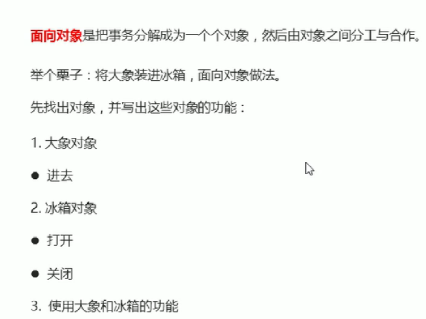
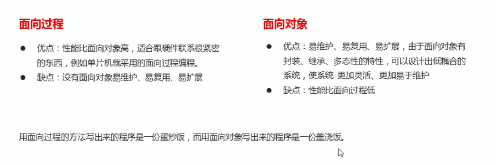
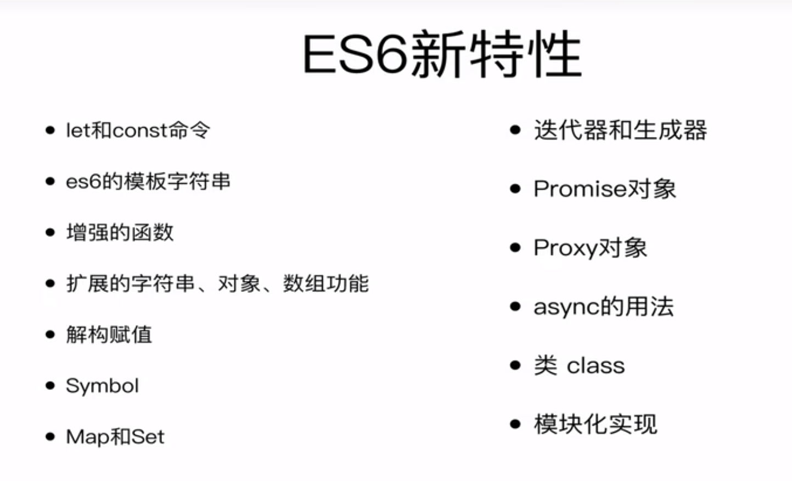
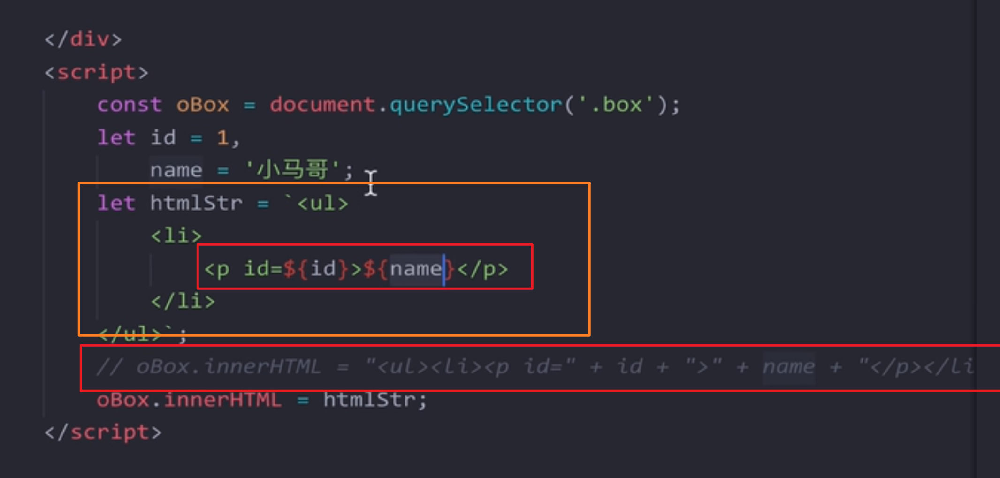
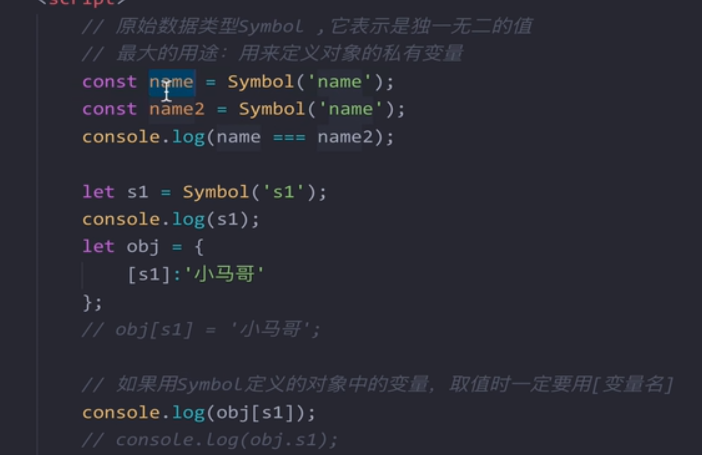
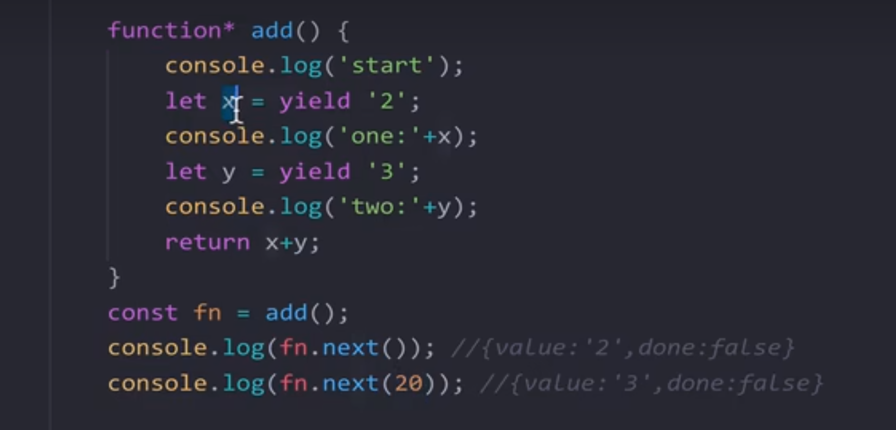

#### 11.5  js高级

##### 面向对象




将问题分解成对象化，并使用对象的功能去解决问题


##### 面向过程和面向对象的优缺点




s


# 续学

## Es6 新特性




## var、 let、  const  

var为es5中，预编译， 可重复定义

let 为 块作用域， 不可重复定义 

const 定义一个常量，一旦被定义后无法被重新定义， 如果为对象时，指定义的地址无法被修改，但是对象的属性可被重新定义


**var 的情况中**

for循环和内部函数的执行作用域不是同一个，内部 只是定义了一个函数

当执行内部函数时为，外部循环语句已经结束，i 为10


**let的情况下**

for循环次数个块，每次都会创建新的变量， 相当于每个函数都有自己i的副本

 let为块作用域，只对当前函数有用，定义的变量无上升到全局变量， 不会污染全局变量 

 

默认情况下 使用 const, 知道变量会被修改时使用let


# 5.31 

## 模板字符串




## 函数默认值、剩余参数

arguments  获取所有实参的方法

伪数组和真数组的区别  

argumments 返回的为一个对象， 是伪数组

不具有数组原型上的其他方法，例如`push`、`pop`


剩余参数返回的为**真数组**，有原型对象，可以使用很多的数组方法和操作


数组赋值给对象的属性时，数组会被转换为对象的值。在 JavaScript 中，对象的属性可以是基本数据类型（如字符串、数字、布尔值）、对象或函数。

数组赋值给对象属性时，实际上是将数组的引用赋值给了属性。这意味着对象属性和原始数组引用的是同一个数组，对数组的修改将在对象属性和原始数组之间共享


## 上下文对象


上下文对象指的是调用函数的主体对象。

>在 JavaScript 中，函数是对象的一种类型，因此函数也可以作为对象的属性或方法进行调用。当函数作为对象的方法调用时，该对象就成为函数的上下文对象，也可以通过 `this` 关键字在函数内部引用该对象。
>
>下面是一个示例，演示函数作为对象方法时的上下文对象：
>
>```javascript
>javascriptCopy codevar obj = {
>  name: 'John',
>  greet: function() {
>    console.log('Hello, ' + this.name);
>  }
>};
>
>obj.greet(); // 输出 "Hello, John"
>```
>
>在上述示例中，`obj` 对象包含一个属性 `name` 和一个方法 `greet`。当调用 `obj.greet()` 时，`obj` 对象成为 `greet` 函数的上下文对象，并且在函数内部可以通过 `this.name` 引用对象的属性值。
>
>需要注意的是，函数的上下文对象在函数调用时确定，并且取决于调用函数的方式。例如，使用 `obj.greet()` 调用函数时，`obj` 是上下文对象。但是，如果将函数作为独立函数调用，那么上下文对象将是全局对象（在浏览器中为 `window`）。
>
>除了使用对象的方法调用函数外，还可以使用 `call` 或 `apply` 方法显式地设置函数的上下文对象。通过使用这些方法，可以将任意对象作为函数的上下文对象进行调用。
>
>总结：上下文对象指的是调用函数的主体对象，可以通过 `this` 关键字在函数内部引用该对象。对于函数作为对象的方法调用，对象本身成为函数的上下文对象。使用 `call` 或 `apply` 方法可以显式地设置函数的上下文对象。


## math函数的调用不需要上下文对象

>
>
>对于 `Math` 对象中的函数，它们不需要通过对象进行调用，因为它们是**全局函数**，可以直接使用 `Math` 对象来调用。
>
>在 JavaScript 中，`Math` 是一个**内置对象**，它提供了许多数学相关的方法，如 `Math.max`、`Math.min`、`Math.floor` 等。这些方法是作为 `Math` 对象的静态方法存在的，不依赖于特定的实例或对象。
>
>因此，对于 `Math` 对象中的函数调用，我们可以将上下文对象设置为任意值，包括 `null`。在实际使用中，通常习惯将上下文对象设置为 `null` 或 `undefined`，因为这些值不引用任何特定的对象。
>
>下面是一个示例，演示如何使用 `Math.max` 方法，并将上下文对象设置为 `null`：

>```javascript
>javascriptCopy codevar arr = [3, 7, 2, 9, 1];
>var max = Math.max.apply(null, arr);
>
>console.log(max); // 输出 9
>```
>
>在上述示例中，我们使用 `Math.max` 方法找到数组 `arr` 中的最大值。由于 `Math.max` 是一个静态方法，我们可以直接使用 `Math` 对象来调用它。通过使用 `apply` 方法，我们将上下文对象设置为 `null`，并将数组元素作为参数传递给 `Math.max`。
>
>需要注意的是，由于 `Math.max` 不依赖于上下文对象，因此将上下文对象设置为 `null` 是一种常见的做法，但在实际运行中并不影响函数的执行或结果。


## apply的作用

>
>
>`apply` 是 JavaScript 中的一个函数方法，它的作用是在指定的上下文中调用函数，并以数组形式传递参数。
>
>`apply` 的语法是 `function.apply(thisArg, [argsArray])`，其中：
>
>- `thisArg` 是在函数执行时作为上下文对象的值。
>- `argsArray` 是一个数组或类数组对象，包含作为参数传递给函数的值。
>
>当使用 `apply` 调用函数时，它会将数组中的元素作为参数传递给函数。这意味着，如果将一个数组作为参数传递给 `apply`，它会自动遍历数组的元素，并将它们作为参数传递给被调用的函数。
>
>以下是一个示例，演示如何使用 `apply` 将数组的元素作为参数传递给函数：
>
>```
>javascriptCopy codefunction sum(a, b, c) {
>  return a + b + c;
>}
>
>var numbers = [1, 2, 3];
>var result = sum.apply(null, numbers);
>
>console.log(result); // 输出 6
>```
>
>在上述示例中，我们定义了一个函数 `sum`，它接受三个参数并返回它们的总和。然后，我们创建一个包含三个数字的数组 `numbers`。通过使用 `apply`，我们将 `numbers` 数组的元素 `[1, 2, 3]` 作为参数传递给 `sum` 函数。最终，我们得到了总和为 `6` 的结果。
>
>需要注意的是，`apply` 方法将数组的元素作为参数传递给函数，并将其展开，而不是将整个数组作为单个参数传递。这使得可以使用可变数量的参数调用函数，而不需要手动列出每个参数。
>
>总结：`apply` 方法在函数调用时的作用是，在指定的上下文中调用函数，并以数组形式传递参数。当将数组作为参数传递给 `apply` 时，它会自动遍历数组的元素，并将它们作为参数传递给被调用的函数。


### call与apply类同-传参数有区别

总结：`apply` 和 `call` 是用于在指定上下文中调用函数的方法。它们的区别在于参数的传递方式，`apply` 使用数组或类数组对象作为参数，而 `call` 使用一系列参数作为参数。这些方法允许在特定上下文中调用函数，并传递参数给函数，以便实现特定的功能。


## bind函数绑定

>`bind()` 方法用于创建一个新的函数，该函数将指定的对象作为其上下文，并在调用时将指定的参数绑定到新函数的参数列表中。

以下是一个使用 `bind()` 方法的示例：

```javascript
javascriptCopy codefunction greet(name) {
  console.log('Hello, ' + name + '!');
}

var person = {
  name: 'Alice'
};

var greetPerson = greet.bind(person, 'Bob');
greetPerson(); // 输出 "Hello, Bob!"
```

>`bind()` 方法不会立即调用原函数，而是返回一个绑定了指定上下文和参数的新函数。如果需要立即调用新函数，可以在函数名后面加上一对括号 `()`。
>
>总结：`bind()` 方法用于创建一个新函数，并将指定的对象作为其上下文，并在调用时将指定的参数绑定到新函数的参数列表中。它的主要作用是显式绑定函数的上下文和预设参数。通过 `bind()` 方法，可以创建一个绑定了特定上下文和参数的新函数，以便在稍后的调用中使用。


## document对象

>
>
>在前端开发中，`document` 是一个全局对象，表示当前网页的文档对象模型（Document Object Model，简称 DOM）。它是 JavaScript 访问和操作网页内容的主要接口。
>
>`document` 对象提供了各种属性和方法，可以用于获取、创建和修改网页的元素、样式、文本等内容。通过 `document` 对象，可以访问网页中的各种元素，例如页面的标题、段落、图像、表单等。可以使用 `document` 对象提供的方法，例如选择元素、修改元素样式、添加或删除元素等。
>
>以下是一些常见的 `document` 对象的属性和方法：
>
>- `document.getElementById(id)`：通过指定元素的 ID 获取对应的 DOM 元素。
>- `document.querySelector(selector)`：通过 CSS 选择器选择第一个匹配的元素。
>- `document.querySelectorAll(selector)`：通过 CSS 选择器选择所有匹配的元素。
>- `document.createElement(tagName)`：创建一个指定标签名的新元素。
>- `document.createTextNode(text)`：创建一个包含指定文本内容的文本节点。
>- `document.getElementById(id).innerHTML`：获取或设置指定元素的 HTML 内容。
>- `document.getElementById(id).style.property`：获取或设置指定元素的 CSS 样式属性。
>- `document.getElementById(id).addEventListener(event, handler)`：为指定元素添加事件监听器。
>
>需要注意的是，`document` 对象是浏览器提供的内置对象，用于操作当前网页的 DOM 结构。它可以在 JavaScript 代码中直接访问，无需特别引入或声明。
>
>总结：`document` 对象是代表当前网页的文档对象模型（DOM），用于访问和操作网页的元素、样式、文本等内容。它是 JavaScript 访问网页的主要接口，提供了丰富的属性和方法，用于获取、创建和修改网页的各种元素和内容。通过 `document` 对象，可以实现对网页的动态操作和交互。


## 箭头函数

>在箭头函数中，`this` 关键字的指向与普通函数不同。
>
>箭头函数没有自己的 `this` 值，而是继承自外部作用域的 `this` 值。
>
>具体来说，箭头函数内部的 `this` 指向的是定义箭头函数时所处的词法作用域的 `this` 值，而不是调用箭头函数时的执行上下文的 `this` 值。这使得箭头函数在处理上下文绑定时更加简洁和可靠。
>
>以下是一个示例，展示了箭头函数内部的 `this` 指向：
>
>```javascript
>javascriptCopy codevar obj = {
>  name: 'Alice',
>  sayHello: function() {
>    setTimeout(() => {
>      console.log('Hello, ' + this.name + '!');
>    }, 1000);
>  }
>};
>
>obj.sayHello(); // 输出 "Hello, Alice!"，而不是 "Hello, undefined!"
>```
>
>在上述示例中，`obj` 对象包含一个 `sayHello` 方法，它使用箭头函数定义了一个延迟执行的回调函数。在箭头函数内部，我们使用 `this.name` 访问了外部的 `this` 值。由于箭头函数继承了外部作用域的 `this` 值，所以 `this.name` 实际上指向了 `obj` 对象的 `name` 属性，输出了正确的结果。
>
>相比之下，如果我们在回调函数中使用普通函数定义，`this` 的指向将发生变化：
>
>```javascript
>javascriptCopy codevar obj = {
>  name: 'Alice',
>  sayHello: function() {
>    setTimeout(function() {
>      console.log('Hello, ' + this.name + '!');
>    }, 1000);
>  }
>};
>
>obj.sayHello(); // 输出 "Hello, undefined!"
>```
>
>在这个示例中，回调函数使用**普通函数定义**，它会在调用时创建一个新的执行上下文。在这个新的执行上下文中，`this` 不再指向 `obj` 对象，而是指向全局对象（例如浏览器中的 `window` 对象）。因此，`this.name` 将返回 `undefined`。
>
>总结：箭头函数内部的 `this` 指向的是定义箭头函数时所处的词法作用域的 `this` 值，而不是调用箭头函数时的执行上下文的 `this` 值。这使得箭头函数可以更方便地访问外部作用域的 `this` 值，避免了普通函数中 `this` 指向的问题。


## 箭头函数无法实例化对象

>
>
>是的，你是正确的。箭头函数不能被使用 `new` 关键字实例化对象，因为箭头函数没有自己的 `this` 值。箭头函数的 `this` 值是继承自外部作用域，无法通过 `new` 关键字改变。
>
>当我们使用 `new` 关键字实例化一个对象时，通常会创建一个新的空对象，并将该对象作为 `this` 值传递给构造函数，以便在构造函数中初始化该对象的属性和方法。然而，箭头函数没有自己的 `this` 值，它会继承外部作用域中的 `this` 值，因此无法作为构造函数来使用。
>
>以下是一个示例，展示了箭头函数无法使用 `new` 关键字实例化对象：
>
>```javascript
>const MyConstructor = () => {
>  this.name = 'Alice'; // 错误：箭头函数没有自己的 this 值
>};
>
>const obj = new MyConstructor(); // 错误：无法使用 new 关键字实例化箭头函数
>```
>
>在上述示例中，我们尝试使用箭头函数 `MyConstructor` 作为构造函数，并使用 `new` 关键字实例化一个对象。然而，这会导致错误，因为箭头函数没有自己的 `this` 值，无法使用 `new` 关键字进行实例化。
>
>因此，在需要使用 `new` 关键字实例化对象的情况下，应该使用普通函数来定义构造函数，而不是箭头函数。普通函数具有自己的 `this` 值，并且可以通过 `new` 关键字正确地初始化对象。


#  6.2 凌晨12点45

## Smbol

Symbol定义的类型为独一无二的值， 用来定义对象的私有变量，不可被其它对象定义或改值



使用时需要加上[ ] ， 如图， 该属性在外界访问为隐形属性

需用使用两个方法进行访问：

-  Object.getownPropertySymbols(obj), 返回obj特有的属性
-  Reflect.ownKeys(obj)


## set和weakSet

Set适用于需要存储任何类型的值，需要迭代器支持，并且不需要动态添加或删除元素的场景。而WeakSet适用于需要存储对象类型的值，需要动态添加或删除元素，并且不需要迭代器支持的场景


>
>
>Set 和 WeakSet 都是 JavaScript 中的集合类型，用于存储唯一的值。它们的主要区别在于对值的引用和存储方式的不同。
>
>Set：
>- Set 是一个可迭代的对象，它存储唯一的值，并按照插入顺序维护这些值。
>- Set 中的值可以是任何类型，包括原始类型和对象引用。
>- Set 中的值是唯一的，重复的值只会被存储一次。
>- Set 提供了一系列的方法来操作和遍历集合，如 `add()`、`delete()`、`has()` 和 `forEach()`。
>
>以下是一个使用 Set 的示例：
>
>```javascript
>const set = new Set();
>set.add(1);
>set.add(2);
>set.add(3);
>set.add(2); // 重复的值，不会被存储
>
>console.log(set.size); // 输出 3
>
>console.log(set.has(2)); // 输出 true
>
>set.forEach(value => {
>  console.log(value);
>});
>```
>
>WeakSet：
>- WeakSet 是一种特殊的集合类型，它只能存储对象引用。
>- WeakSet 中的对象引用是弱引用，不会阻止被引用对象的垃圾回收。
>- WeakSet 中的对象是唯一的，重复的对象引用不会被存储。
>- WeakSet 不可迭代，没有提供类似 `forEach()` 的遍历方法。
>
>以下是一个使用 WeakSet 的示例：
>
>```javascript
>const weakSet = new WeakSet();
>const obj1 = {};
>const obj2 = {};
>const obj3 = {};
>
>weakSet.add(obj1);
>weakSet.add(obj2);
>weakSet.add(obj3);
>weakSet.add(obj2); // 重复的对象引用，不会被存储
>
>console.log(weakSet.has(obj2)); // 输出 true
>
>weakSet.delete(obj1);
>
>console.log(weakSet.has(obj1)); // 输出 false
>```
>
>需要注意的是，WeakSet 中的对象引用是弱引用，意味着如果没有其他地方引用该对象，它可能会被垃圾回收。因此，WeakSet 通常用于存储临时的、瞬时的对象引用，例如在特定上下文中临时跟踪对象，而不会阻止这些对象被垃圾回收。
>
>


## `Object.getOwnPropertySymbols()` 方法和 `Reflect.ownKeys()` 方法

>
>
>`Object.getOwnPropertySymbols()` 方法和 `Reflect.ownKeys()` 方法都是用于获取对象的属性信息，包括符号属性（Symbol）。
>
>1. `Object.getOwnPropertySymbols()` 方法：
>   - `Object.getOwnPropertySymbols()` 方法返回一个数组，包含了指定对象自身的所有符号属性（Symbol）的属性键。
>   - 这个方法只返回对象自身的符号属性，不包括继承的属性。
>   - 使用示例：
>     ```javascript
>     const obj = {
>       [Symbol("foo")]: "fooValue",
>       [Symbol("bar")]: "barValue",
>     };
>         
>     const symbols = Object.getOwnPropertySymbols(obj);
>     console.log(symbols); // [Symbol(foo), Symbol(bar)]
>     ```
>
>2. `Reflect.ownKeys()` 方法：
>   - `Reflect.ownKeys()` 方法返回一个由目标对象自身的属性键组成的数组，包括字符串属性和符号属性（Symbol）。
>   - 这个方法返回的是目标对象自身的所有属性键，不区分属性的类型。
>   - 使用示例：
>     ```javascript
>     const obj = {
>       [Symbol("foo")]: "fooValue",
>       [Symbol("bar")]: "barValue",
>       strProp: "stringValue",
>     };
>         
>     const keys = Reflect.ownKeys(obj);
>     console.log(keys); // [Symbol(foo), Symbol(bar), 'strProp']
>     ```
>
>总结：
>- `Object.getOwnPropertySymbols()` 方法返回对象自身的所有符号属性（Symbol）的属性键的数组。
>- `Reflect.ownKeys()` 方法返回对象自身的所有属性键的数组，包括字符串属性和符号属性（Symbol）。
>
>需要注意的是，这两个方法都不会返回继承的属性，只返回对象自身的属性。如果需要获取继承的属性，可以使用 `for...in` 循环或 `Object.keys()` 方法。


## for each(val, kye)

>
>
>代码片段展示了对 Set 数据结构中的元素进行遍历并输出值和键的过程。`Set.forEach()` 方法用于遍历 Set 中的每个元素，并为每个元素执行回调函数。
>
>在你提供的代码中，`set` 是一个 Set 对象，然后使用 `set.forEach()` 方法进行遍历。回调函数接受两个参数 `val` 和 `key`，分别表示当前元素的值和键。在回调函数内部，通过 `console.log()` 分别输出 `val` 和 `key`。
>
>以下是代码的解析和示例：
>
>```javascript
>set.forEach((val, key) => {
>  console.log(val); // 输出当前元素的值
>  console.log(key); // 输出当前元素的键
>});
>```
>
>在这个示例中，假设 `set` 是一个 Set 对象，包含多个元素。通过调用 `set.forEach()` 方法，遍历每个元素并执行回调函数。在回调函数内部，`val` 表示当前元素的值，`key` 表示当前元素的键（在 Set 中，值和键相等）。
>
>请注意，Set 对象是一种集合，它不像数组那样具有索引，因此遍历元素时没有确定的顺序。在使用 `set.forEach()` 方法时，元素的顺序是根据 Set 内部的实现决定的，并不能保证顺序一致。如果需要有序的遍历，可以将 Set 转换为数组，然后使用数组的遍历方法，例如 `Array.from(set).forEach()` 或 `Array.from(set).forEach()`。


## set.size

>
>
>Set 的 `size` 属性是 Set 对象的一个只读属性，用于返回 Set 中存储的唯一值的数量。
>
>以下是关于 Set 的 `size` 属性的一些特点：
>
>- `size` 属性返回的是一个数字，表示 Set 中的唯一值的数量。
>- 当往 Set 中添加新的唯一值时，`size` 属性会自动更新。
>- `size` 属性是只读的，无法通过赋值来修改。
>
>以下是一个使用 Set 的 `size` 属性的示例：
>
>```javascript
>const set = new Set();
>
>set.add(1);
>set.add(2);
>set.add(3);
>
>console.log(set.size); // 输出 3
>
>set.add(4);
>
>console.log(set.size); // 输出 4
>
>set.delete(2);
>
>console.log(set.size); // 输出 3
>```
>
>在上述示例中，我们首先创建一个空的 Set 对象 `set`。然后，使用 `add()` 方法向 Set 中添加了一些唯一的值。通过访问 `set.size` 属性，我们可以获取 Set 中存储的唯一值的数量。在添加或删除元素后，`size` 属性会相应地更新。
>
>需要注意的是，Set 中存储的是唯一的值，重复的值只会被存储一次。因此，Set 的 `size` 属性返回的是去重后的值的数量。


## 强引用和弱引用，资源回收

>
>
>在你的示例中，虽然将 `obj` 设置为 `null`，但是由于 `set2` 中仍然保持对 `obj` 的引用，因此 `obj` 不会被垃圾回收。
>
>在 JavaScript 中，垃圾回收器通过检查对象是否存在引用来确定是否将其回收。即使你在代码中将一个对象设置为 `null`，只要其他地方仍然有对该对象的引用，它就不会被回收。
>
>在你的代码中，当执行 `set2.add(obj)` 将 `obj` 添加到 `set2` 中时，`set2` 会保持对 `obj` 的引用。即使在后续将 `obj` 设置为 `null`，`set2` 仍然保留了对原始对象的引用。
>
>因此，当你打印 `set2` 时，它仍然会显示集合中包含了原始的对象。`set2.size` 属性也会返回集合中的元素数量，因为 `obj` 仍然存在于集合中。
>
>如果你想要释放对象并从集合中删除它，可以使用 `set2.delete(obj)` 方法手动删除它，或者等待垃圾回收器自动回收无引用的对象。


## set中添加字符串数字和数字行为等价

在 Set 中，每个元素都是按照其严格相等性进行存储和比较的。当你向 Set 添加 `'1'` 时，它会被视为字符串类型的值，而不是字符

>
>
>在 Set 中，当你向 Set 添加元素时，它会根据元素的值的严格相等性进行判断，而不会根据类型进行区分。因此，添加 `1` 和 `'1'` 到 Set 中会被视为相同的元素。
>
>示例代码：
>
>```javascript
>const set = new Set();
>set.add(1);
>set.add('1');
>
>console.log(set.size); // 输出结果为 1，因为只有一个元素
>
>console.log(set.has(1)); // 输出结果为 true，元素 1 存在于 Set 中
>console.log(set.has('1')); // 输出结果为 true，元素 '1' 存在于 Set 中
>```
>
>在上述示例中，向 Set 中添加 `1` 和 `'1'`，它们的值都是相同的，都是数字1。因此，它们会被视为相同的元素，并且 Set 中只会保留一个唯一的元素。
>
>需要注意的是，尽管它们的类型不同（一个是数字，一个是字符串），但在 Set 中的严格相等性比较中，它们会被视为相等的元素。
>
>所以，添加 `1` 和 `'1'` 到 Set 中都会被识别为相同的元素，并且 Set 中只会保留一个唯一的元素。


### set集中的entries

>
>
>如果你向 Set 集合中添加了一个对象，并且在控制台中打印集合时看到了两个 `[[Entries]]`，可能是由于控制台的输出格式导致的误解。
>
>在控制台中，`[[Entries]]` 并不表示实际的元素，而是表示 Set 集合的迭代器对象。`[[Entries]]` 是迭代器对象的内部属性，用于支持集合的迭代操作。
>
>当你在控制台中打印 Set 集合时，控制台可能会以不同的方式显示集合的属性和值，具体取决于控制台的实现。有些控制台可能会显示 `[[Entries]]` 或类似的标识符，以指示该对象具有迭代器功能。
>
>下面是一个示例：
>
>```javascript
>const set = new Set();
>set.add({ name: "John" });
>
>console.log(set);
>```
>
>在某些控制台中，上述示例可能会显示类似以下的结果：
>
>```
>Set(1) { { name: "John" } }
>  [[Entries]]: Array(1)
>    0: Object
>      name: "John"
>      [[Prototype]]: Object
>```
>
>在这个输出中，`[[Entries]]` 只是迭代器对象的内部属性，并不表示实际的元素。实际的元素是在 `[[Entries]]` 数组中的索引位置上，以对象的形式存在。
>
>请注意，具体的控制台输出可能因不同的环境和控制台实现而有所不同。不同的控制台可能使用不同的方式来显示 Set 集合及其属性。
>
>总结起来，**`[[Entries]]` 只是迭代器对象的内部属性，并不表示实际的元素**。你添加的对象只有一个，所以实际元素的数量是正确的。输出中显示的 `[[Entries]]` 不会影响实际的 Set 集合元素数量。


## textContent 和 innerHtml的异同

`textContent` 和 `innerHTML` 在功能上有相似之处，都用于获取和设置元素的内容。然而，它们之间存在一些重要的区别。

1. 内容类型：
   - `textContent` 返回元素及其子节点的纯文本内容，不包括任何 HTML 标签。它只返回文本内容，并忽略任何 HTML 结构。
   - `innerHTML` 返回元素及其子节点的完整 HTML 内容，包括所有的 HTML 标签和文本内容。它返回的是一个字符串，包含元素的 HTML 结构。

2. HTML 解析和处理：
   - `textContent` 不会解析和处理 HTML，它将所有内容都视为纯文本。即使文本中包含 HTML 标签，它们也会被当作普通文本显示。
   - `innerHTML` 会解析和处理 HTML，它将传递给它的字符串作为 HTML 解析，并在元素中生成相应的 DOM 结构。它可以用于插入 HTML 片段、创建新的元素等。

3. 安全性：
   - `textContent` 是安全的，因为它不会执行任何脚本或解析任何 HTML。它只返回纯文本内容，不涉及脚本执行的风险。
   - `innerHTML` 的使用需要谨慎，因为它可以执行传递给它的 HTML 代码，包括其中的脚本。如果直接将用户提供的内容赋值给 `innerHTML`，可能会导致跨站脚本攻击（XSS）的风险。

综上所述，虽然 `textContent` 和 `innerHTML` 在功能上类似，都用于处理元素的内容，但它们的处理方式和返回的内容类型不同。你应根据需要选择适合的属性来操作元素的内容，并注意在使用 `innerHTML` 时避免安全风险。


### [].slice.call(arguments) 语句解析


语句解析：

>
>
>`[].slice.call(arguments)` 是一种常用的将类数组对象转换为真正数组的方法，它使用了 `Array` 原型上的 `slice` 方法。
>
>解析该语句的步骤如下：
>
>1. `[]` 创建了一个空数组字面量。这是因为 `slice` 方法是 `Array` 原型上的方法，我们需要通过一个数组来访问它。
>2. `slice` 是 `Array` 原型上的方法，它用于提取数组的一部分，返回一个新的数组。但是，我们这里并没有一个真正的数组，而是一个类数组对象 `arguments`。
>3. `call()` 是 `Function` 原型上的方法，它允许我们将一个函数作为指定的上下文对象进行调用。在这里，我们通过 `call()` 方法将 `slice` 方法的上下文设置为 `arguments`，以便在类数组对象上调用它。
>4. `arguments` 是一个特殊的对象，它包含了函数调用时传递的所有参数。在函数内部，我们可以使用 `arguments` 访问这些参数。但是，`arguments` 并不是一个真正的数组，它没有 `slice` 方法。通过使用 `call()` 方法，我们可以将 `slice` 方法借用到 `arguments` 对象上，使其可以像数组一样使用。
>5. 最终，`[].slice.call(arguments)` 将 `slice` 方法应用于 `arguments` 对象，并返回一个真正的数组，其中包含了 `arguments` 对象的元素。
>
>总结来说，`[].slice.call(arguments)` 的目的是将 `arguments` 对象转换为一个真正的数组。它使用了 `slice` 方法并设置了 `arguments` 作为上下文，以便在类数组对象上调用该方法。这样，我们就可以使用数组的方式来操作 `arguments` 中的参数。


slice为数组的方法， 指生成一个新的数组，通过调用Array方法，slice指定arguments（类数组的元素）， 相当于类数组对象借用数组对象方法 slice， 生成了一个数组


---


## from 和 of 方法

from 将类数组转化为数组

 of为接受任意参数(数组，数组，对象…)，并这些参数作为新数组的元素生成一个数组

>
>
>`Array.from()` 和 `Array.of()` 是 JavaScript 中用于处理数组的方法。
>
>1. `Array.from()` 方法将类数组对象或可迭代对象转换为一个新的真正的数组。它接受一个类数组对象或可迭代对象作为第一个参数，并可选地接受一个映射函数和一个上下文对象作为参数。它会返回一个新的数组，其中包含从输入对象中提取的元素。
>
>示例代码：
>```javascript
>const arrayLike = { 0: 'a', 1: 'b', 2: 'c', length: 3 };
>const newArray = Array.from(arrayLike);
>console.log(newArray); // 输出结果为 ['a', 'b', 'c']
>```
>
>在上述示例中，我们将一个类数组对象 `arrayLike` 传递给 `Array.from()` 方法，它会将该对象转换为一个新的数组 `newArray`。转换结果是一个包含类数组对象的元素的真正的数组。
>
>2. `Array.of()` 方法创建一个新的数组，并将传递给它的参数作为数组的元素。它会接受任意数量的参数，并将它们作为数组的元素组合在一起。
>
>示例代码：
>```javascript
>const newArray = Array.of('a', 'b', 'c');
>console.log(newArray); // 输出结果为 ['a', 'b', 'c']
>```
>
>在上述示例中，我们将三个字符串作为参数传递给 `Array.of()` 方法，它会将这些字符串组合成一个新的数组 `newArray`。
>
>关于 `[].slice.call(arguments)` 的解释：
>
>这是一个经典的 ES5 转换类数组对象为真正数组的方法。`arguments` 对象是一个类数组对象，它包含了函数调用时传递的所有参数。由于 `arguments` 不是一个真正的数组，我们无法直接使用数组方法。通过使用 `Array.prototype.slice.call(arguments)`，我们可以借用 `Array` 原型上的 `slice()` 方法，并将 `arguments` 视为 `this` 对象进行调用。这将返回一个真正的数组，其中包含了 `arguments` 的元素。
>
>示例代码：
>```javascript
>function example() {
>  const arr = [].slice.call(arguments);
>  console.log(arr);
>}
>
>example('a', 'b', 'c'); // 输出结果为 ['a', 'b', 'c']
>```
>
>在上述示例中，我们使用 `[].slice.call(arguments)` 将 `arguments` 对象转换为一个真正的数组，并将其赋值给变量 `arr`。然后，我们打印输出了这个数组，结果为 `['a', 'b', 'c']`。这种方法允许我们在类数组对象上使用数组方法。


## 数组方法见 39 -40文件


## yield 与生成器搭配使用

>
>
>`yield` 是 JavaScript 中的一个关键字，用于定义生成器函数（Generator Function）中的一个暂停点。生成器函数是一种特殊的函数，可以通过多次迭代的方式产生一系列的值。
>
>当生成器函数执行到 `yield` 语句时，函数的执行会暂停，并将 `yield` 后面的值作为生成器的下一个值返回。生成器函数可以被多次调用，并且每次调用都会从上一个暂停点继续执行，产生下一个值。
>
>下面是一个简单的示例来说明 `yield` 的用法：
>
>```javascript
>function* generateNumbers() {
>  yield 1;
>  yield 2;
>  yield 3;
>}
>
>const generator = generateNumbers();
>
>console.log(generator.next().value); // 输出结果为 1
>console.log(generator.next().value); // 输出结果为 2
>console.log(generator.next().value); // 输出结果为 3
>console.log(generator.next().value); // 输出结果为 undefined
>```
>
>在上面的示例中，我们定义了一个生成器函数 `generateNumbers()`，它通过 `yield` 语句依次产生了数值 1、2 和 3。我们通过调用 `generateNumbers()` 返回一个生成器对象 `generator`，然后使用 `generator.next()` 来逐个获取生成器产生的值。
>
>每次调用 `generator.next()`，生成器函数会执行到下一个 `yield` 语句，并将 `yield` 后面的值作为结果返回。当生成器函数执行完所有的 `yield` 语句后，再次调用 `generator.next()` 会返回一个 `undefined` 值，表示生成器函数的执行已经结束。
>
>通过使用 `yield` 和生成器函数，我们可以实现一种更灵活和可控的迭代器，可以逐步产生值，而不是一次性返回所有的值。这在处理大型数据集或需要逐步处理的场景中非常有用。


### yield  传参



**传入的实参作为上一个yield的返回值**

-  此举会导致第一次传入实参与yield相关的计算操作无效,不会对一个进行赋值

next的传参每次**只传给上一个yield值**，所以第一个next如果传参 则x不会被赋值 

因为yield 在yield = '2' 时中止, 所以当继续执行时,才能将赋值返回 x

第二次的传入参数 20是给了上一个yield，所以x等于20


## object.keys作用

>
>
>`Object.keys()` 是 JavaScript 中的一个静态方法，用于返回一个给定对象自身可枚举属性的数组。
>
>它接受一个对象作为参数，并返回该对象自身可枚举属性的键名（属性名）组成的数组。返回的数组中的键名按照对象中出现的顺序排列。
>
>下面是一个简单的示例来说明 `Object.keys()` 的用法：
>
>```javascript
>const obj = {
>  name: 'John',
>  age: 30,
>  city: 'New York'
>};
>
>const keys = Object.keys(obj);
>
>console.log(keys); // 输出结果为 ['name', 'age', 'city']
>```
>
>在上面的示例中，我们有一个名为 `obj` 的对象，它包含了三个属性：`name`、`age` 和 `city`。我们调用 `Object.keys(obj)` 来获取 `obj` 对象的属性名组成的数组。最后，我们将该数组打印到控制台，得到 `['name', 'age', 'city']`。
>
>需要注意的是，`Object.keys()` 只返回对象自身的可枚举属性，不包括继承的属性。如果需要获取所有的键名，包括继承的属性，可以使用 `for...in` 循环或 `Object.getOwnPropertyNames()` 方法。
>
>总结来说，`Object.keys()` 方法用于返回一个对象自身可枚举属性的键名组成的数组。它在处理对象属性时非常有用，可以帮助我们快速获取对象的属性列表。


# 6.3

## ajax

>
>
>AJAX（Asynchronous JavaScript and XML）是一种用于创建异步请求的前端技术。它通过使用 JavaScript 和浏览器提供的 XMLHttpRequest 对象，实现了在不刷新整个页面的情况下，向服务器发送请求并获取响应数据的能力。
>
>传统的网页交互通常需要整页刷新，而使用 AJAX 技术可以在后台与服务器进行数据交换，只更新页面的部分内容，从而提升用户体验和页面性能。
>
>AJAX 的特点包括：
>
>1. 异步通信：AJAX 使用异步方式发送请求和处理响应，不会阻塞页面的其他操作。
>
>2. 部分刷新：通过 AJAX，可以仅更新页面的部分内容，而不需要刷新整个页面。
>
>3. 数据交换：AJAX 可以与服务器进行数据交换，包括发送数据到服务器和获取服务器返回的数据。
>
>4. 前端技术：AJAX 是一种前端技术，利用 JavaScript 和 XMLHttpRequest 对象实现异步通信。
>
>5. 数据格式：尽管名字中包含 "XML"，但实际上 AJAX 并不限于 XML 格式，可以处理各种数据格式，如 JSON、HTML、文本等。
>
>AJAX 技术被广泛应用于现代 Web 开发中，用于实现动态网页、无刷新表单提交、实时数据更新等功能。它提供了更好的用户体验和页面性能，并使得前端与后端之间的数据交互更加灵活和高效。AJAX（Asynchronous JavaScript and XML）是一种用于创建异步请求的前端技术。它通过使用 JavaScript 和浏览器提供的 XMLHttpRequest 对象，实现了在不刷新整个页面的情况下，向服务器发送请求并获取响应数据的能力。
>
>传统的网页交互通常需要整页刷新，而使用 AJAX 技术可以在后台与服务器进行数据交换，只更新页面的部分内容，从而提升用户体验和页面性能。
>
>AJAX 的特点包括：
>
>1. 异步通信：AJAX 使用异步方式发送请求和处理响应，不会阻塞页面的其他操作。
>
>2. 部分刷新：通过 AJAX，可以仅更新页面的部分内容，而不需要刷新整个页面。
>
>3. 数据交换：AJAX 可以与服务器进行数据交换，包括发送数据到服务器和获取服务器返回的数据。
>
>4. 前端技术：AJAX 是一种前端技术，利用 JavaScript 和 XMLHttpRequest 对象实现异步通信。
>
>5. 数据格式：尽管名字中包含 "XML"，但实际上 AJAX 并不限于 XML 格式，可以处理各种数据格式，如 JSON、HTML、文本等。
>
>AJAX 技术被广泛应用于现代 Web 开发中，用于实现动态网页、无刷新表单提交、实时数据更新等功能。它提供了更好的用户体验和页面性能，并使得前端与后端之间的数据交互更加灵活和高效。


## 同步信息和异步信息

>
>
>同步信息和异步信息是指在计算机通信或数据传输中，消息的传递方式和处理方式的不同。
>
>- 同步信息：在同步通信中，发送方发送消息后会等待接收方对消息的处理和回复，发送方会一直阻塞等待直到接收到回复或超时。在同步模式下，通信双方的操作是相互依赖的，必须按照确定的顺序和时间进行消息的传递和处理。
>
>- 异步信息：在异步通信中，发送方发送消息后不会立即等待接收方的回复，而是可以继续进行其他操作。发送方和接收方是相互独立的，可以并行进行消息的发送和处理。接收方可以在合适的时间处理消息，并在处理完毕后发送回复。异步通信可以提高系统的并发性和响应性，允许同时处理多个消息和任务。
>
>在计算机网络和Web开发中，常用的异步通信方式包括 AJAX、WebSocket、异步请求等，这些技术可以在不阻塞用户界面的情况下进行数据传输和处理。相比之下，同步通信方式会造成阻塞，因为发送方必须等待接收方的回复才能继续进行后续操作。
>
>总的来说，同步信息和异步信息是根据消息的传递方式和处理方式来区分的，它们在不同的场景和需求下有不同的应用和优势。


### 适用场景

同步信息和异步信息是指在计算机通信或数据传输中，消息的传递方式和处理方式的不同。

- **同步信息**：在同步通信中，发送方发送消息后会等待接收方对消息的处理和回复，发送方会一直阻塞等待直到接收到回复或超时。**在同步模式下**，**通信双方的操作是相互依赖的，必须按照确定的顺序和时间进行消息的传递和处理。**
- **异步信息**：在**异步通信**中，发送方发送消息后不会立即等待接收方的回复，而是可以继续进行其他操作。发送方和接收方是**相互独立**的，可以并行进行消息的发送和处理。接收方可以在合适的时间处理消息，并在处理完毕后发送回复。异**步通信可以提高系统的并发性和响应性，允许同时处理多个消息和任务。**

在计算机网络和Web开发中，常用的异步通信方式包括 AJAX、WebSocket、异步请求等，这些技术可以在不阻塞用户界面的情况下进行数据传输和处理。相比之下，同步通信方式会造成阻塞，因为发送方必须等待接收方的回复才能继续进行后续操作。

总的来说，同步信息和异步信息是根据消息的传递方式和处理方式来区分的，它们在不同的场景和需求下有不同的应用和优势。


同步信息： 可以确保信息的准确性，可靠性和一致性，当需要按照特定的顺序处理时，使用此处理方式

异步信息：避免阻塞，并发性，发送方和接送方相互独立，可以并行发送信息和处理，可提高系统的并发性和适用性，允许同时处理多个消息和任务。


## jquery库

>
>
>jQuery是一个广泛使用的JavaScript库，它简化了JavaScript与HTML文档、处理事件、执行动画、处理AJAX请求等常见操作之间的交互。jQuery的目标是使Web开发更加简单、快速和可靠。
>
>以下是一些jQuery的特点和功能：
>
>1. 简化DOM操作：jQuery提供了简洁而强大的DOM操作方法，使开发者可以轻松地选择元素、修改样式、操作内容、处理事件等，不需要编写冗长的原生JavaScript代码。
>
>2. 事件处理：jQuery简化了事件处理的过程，通过统一的事件绑定和处理方法，开发者可以方便地为元素添加事件监听器，响应用户的交互操作。
>
>3. 动画效果：jQuery提供了丰富的动画效果和过渡效果的方法，使开发者能够轻松地创建各种动态效果，如淡入淡出、滑动、渐变等，提升用户体验。
>
>4. AJAX请求：jQuery简化了使用AJAX进行数据交互的过程，提供了简单易用的AJAX方法，使开发者可以轻松地发送异步请求、处理响应、更新页面内容。
>
>5. 跨浏览器兼容性：jQuery封装了许多常见的跨浏览器兼容性问题，使开发者可以更好地处理不同浏览器之间的差异，确保代码在各种环境下的稳定性和一致性。
>
>总的来说，jQuery简化了JavaScript在Web开发中的许多常见任务，使开发者能够更高效地编写代码，并提供了丰富的插件生态系统，使开发者能够通过扩展功能来满足各种需求。它在过去的几年中广泛应用于Web开发，但随着现代Web技术的发展，如ES6和前端框架的兴起，jQuery的使用逐渐减少，但仍然在一些项目和旧有代码中被广泛使用。


## Jquery的使用

>
>
>使用jQuery非常简单，以下是一些基本的使用方式：
>
>1. 引入jQuery库：在HTML文件的`<head>`或`<body>`标签中添加如下代码，引入jQuery库文件。
>```html
><script src="https://code.jquery.com/jquery-3.6.0.min.js"></script>
>```
>
>2. 编写jQuery代码：在引入jQuery库后，就可以在JavaScript代码中使用jQuery的功能了。
>
>   - 选择元素：可以使用CSS选择器来选择DOM元素。
>   ```javascript
>   // 选择所有的段落元素并隐藏它们
>   $("p").hide();
>   ```
>
>   - 修改元素样式：可以使用`css()`方法来修改元素的CSS样式。
>   ```javascript
>   // 将所有标题元素的颜色设置为红色
>   $("h1, h2, h3").css("color", "red");
>   ```
>
>   - 处理事件：可以使用`on()`方法来绑定和处理事件。
>   ```javascript
>   // 当按钮被点击时显示一个提示框
>   $("#myButton").on("click", function() {
>     alert("Button clicked!");
>   });
>   ```
>
>   - 发送AJAX请求：可以使用`$.ajax()`方法发送异步请求。
>   ```javascript
>   // 发送GET请求并处理响应
>   $.ajax({
>     url: "https://api.example.com/data",
>     method: "GET",
>     success: function(response) {
>       console.log(response);
>     },
>     error: function(error) {
>       console.error(error);
>     }
>   });
>   ```
>
>3. 在文档加载完成后执行jQuery代码：为了确保jQuery代码在DOM加载完成后执行，可以将代码放在`$(document).ready()`函数中，或者使用简化的`$(function() { ... })`形式。
>```javascript
>$(document).ready(function() {
>  // 在DOM加载完成后执行的代码
>});
>
>// 或者简化形式
>$(function() {
>  // 在DOM加载完成后执行的代码
>});
>```
>
>以上是一个简单的jQuery使用示例，你可以根据自己的需求使用jQuery提供的各种功能。如果需要更多详细的信息和示例，可以参考jQuery官方文档：[https://jquery.com/](https://jquery.com/)


### 异步代码同步化 和 递归类似

>
>
>生成器和递归确实有一些相似之处，尤其是在处理异步操作时。
>
>递归是一种通过函数调用自身的方式来解决问题的编程技巧。递归函数可以在每次调用时处理一部分任务，并通过递归调用自身来继续处理剩余的任务，直到达到终止条件。这种方式可以使代码具有循环的效果，但实际上是通过函数调用栈来实现的。
>
>生成器函数是ES6中引入的一种特殊函数，它可以通过`yield`关键字暂停函数的执行，并可以在需要时继续执行。生成器函数通常与迭代器一起使用，可以按需产生值序列。生成器函数可以通过`yield`表达式来生成值，并且可以通过`next()`方法来恢复函数的执行。在处理异步操作时，生成器函数可以暂停等待异步操作完成，然后继续执行后续的代码。
>
>生成器函数的异步代码同步化的感觉与递归类似，因为它们都能够通过暂停和继续执行的方式来处理复杂的任务。不同之处在于生成器函数是通过`yield`和`next()`来控制执行流程，而递归则是通过函数调用自身来实现。
>
>总的来说，生成器函数和递归都是处理复杂任务的有效工具，在不同的场景下可以选择适合的方法来解决问题。生成器函数在处理异步操作时提供了更直观、简洁的代码结构，可以帮助处理异步代码的可读性和可维护性。


